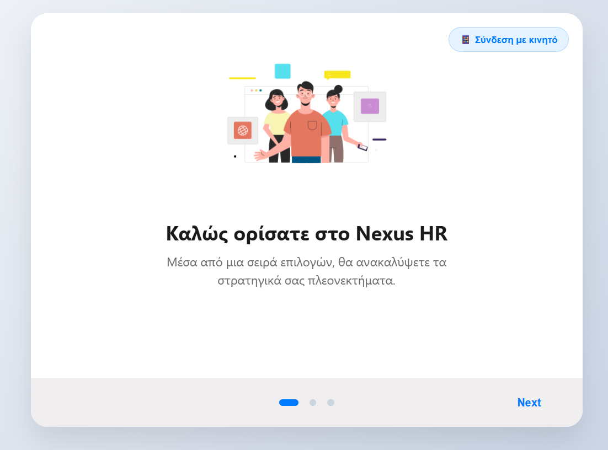
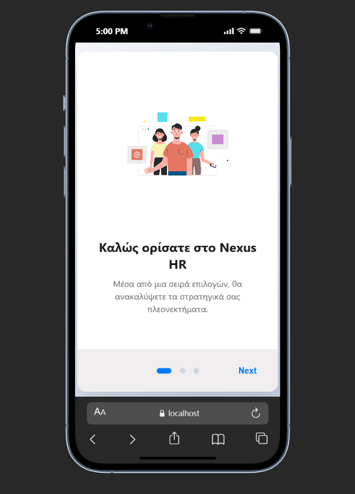

# Nexus HR 
### ⚠️ Personal Project - Not for Commercial Use

**Nexus HR**  isn't just a strengths-tracking tool; it's a team-building architect. While most platforms focus on what an employee does, Nexus HR focuses on how an employee thrives. By mapping the unique DNA of each team member, it provides a blueprint for creating balanced, resilient, and synchronized workforces.

<div align="center" style="display: flex; justify-content: center; align-items: flex-start; gap: 10px;">
  
  
</div>

## ✨ Features
* **Personalized Experience:** User data input and dynamic loading of questions.
* **Smart Algorithm:** Real-time score calculation for 34 different talent themes.
* **Visual Results:** Presentation of the Top 5 talents using Color Coding based on their Domain (Executing, Influencing, Relationship Building, Strategic Thinking).
* **Local Storage:** Automatic recording of results in a JSON file for future analysis.
* **Responsive UI:** Modern design built with React and Material UI.

## 🛠️ Technologies
* **Frontend:** React, TypeScript, Material UI, CSS3.
* **Backend:** Python, Flask, Flask-CORS.
* **Data Handling:** JSON, Python Dictionaries.

---

## 🚀 Installation Instructions

1.  **Backend:**
    ```bash
    cd backend
    python main.py
    ```
2.  **Frontend:**
    ```bash
    cd frontend
    npm install
    npm start
    ```